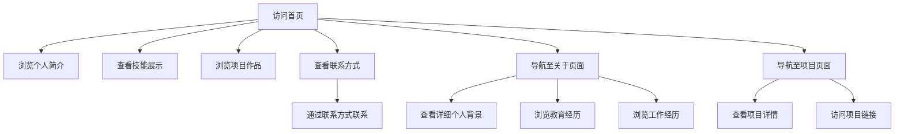

## 1. Product Overview
个人主页网站，用于展示个人信息、技能和项目。
- 主要目的是提供个人专业形象展示平台，方便潜在雇主或合作伙伴了解个人背景。
- 目标用户为招聘方、合作伙伴及行业同行。

## 2. Core Features

### 2.1 User Roles
| Role | Registration Method | Core Permissions |
|------|---------------------|------------------|
| Visitor | No registration required | View all content |
| Owner | Direct access to update content | Edit all content |

### 2.2 Feature Module
1. **首页**: 个人简介、技能展示、项目作品、联系方式
2. **关于页面**: 详细个人背景、教育经历、工作经历
3. **项目页面**: 项目详情、技术栈、项目链接

### 2.3 Page Details
| Page Name | Module Name | Feature description |
|-----------|-------------|---------------------|
| 首页 | 个人简介 | 展示姓名、职业、简短介绍和个人照片 |
| 首页 | 技能展示 | 以进度条或标签形式展示专业技能 |
| 首页 | 项目作品 | 展示精选项目卡片，包含项目名称、简介和图片 |
| 首页 | 联系方式 | 提供邮箱、社交媒体链接等联系方式 |
| 关于页面 | 详细个人背景 | 详细介绍个人经历、专业背景和职业目标 |
| 关于页面 | 教育经历 | 按时间顺序展示教育背景 |
| 关于页面 | 工作经历 | 按时间顺序展示工作经验和职责 |
| 项目页面 | 项目详情 | 展示每个项目的详细信息、技术栈和成果 |
| 项目页面 | 项目链接 | 提供项目代码仓库和演示链接 |

## 3. Core Process
用户访问个人主页 → 浏览首页内容 → 点击导航栏查看关于页面或项目页面 → 通过联系方式模块与个人取得联系

## 4. User Interface Design
### 4.1 Design Style
- 主色调: 深蓝色 (#1a365d) 和白色 (#ffffff)
- 辅助色: 浅蓝色 (#4299e1) 和灰色 (#f7fafc)
- 按钮风格: 圆角矩形，hover效果有轻微阴影和颜色变化
- 字体: 标题使用 Inter 字体，正文使用系统默认无衬线字体
- 字体大小: 标题 24-36px，副标题 18-24px，正文 14-16px
- 布局风格: 响应式卡片式布局，顶部固定导航栏
- 图标风格: 使用 Lucide React 图标库，简约现代风格

### 4.2 Page Design Overview
| Page Name | Module Name | UI Elements |
|-----------|-------------|-------------|
| 首页 | 个人简介 | 居中布局，包含圆形个人头像、姓名、职业标题和简短介绍，背景使用渐变效果 |
| 首页 | 技能展示 | 网格布局的技能卡片，每个卡片包含技能名称和熟练度进度条 |
| 首页 | 项目作品 | 响应式网格布局的项目卡片，包含项目图片、名称和简短描述，hover时有轻微放大效果 |
| 首页 | 联系方式 | 水平排列的社交图标和联系方式，使用 Lucide React 图标 |
| 关于页面 | 详细个人背景 | 左侧个人信息，右侧详细介绍文本，使用卡片式布局 |
| 关于页面 | 教育经历 | 时间轴形式展示，包含学校名称、学位和时间范围 |
| 关于页面 | 工作经历 | 时间轴形式展示，包含公司名称、职位和时间范围 |
| 项目页面 | 项目详情 | 项目卡片点击后展开详细信息，包含项目描述、技术栈和成果 |
| 项目页面 | 项目链接 | 项目卡片底部的链接按钮，指向代码仓库和演示页面 |

### 4.3 Responsiveness
- 设计采用桌面优先原则，同时支持平板和移动设备
- 在移动设备上，网格布局自动调整为单列
- 导航栏在移动设备上折叠为汉堡菜单
- 确保所有内容在不同设备上都能正常显示和交互

### 4.4 3D Scene Guidance
- 不适用，本项目为传统2D网页设计