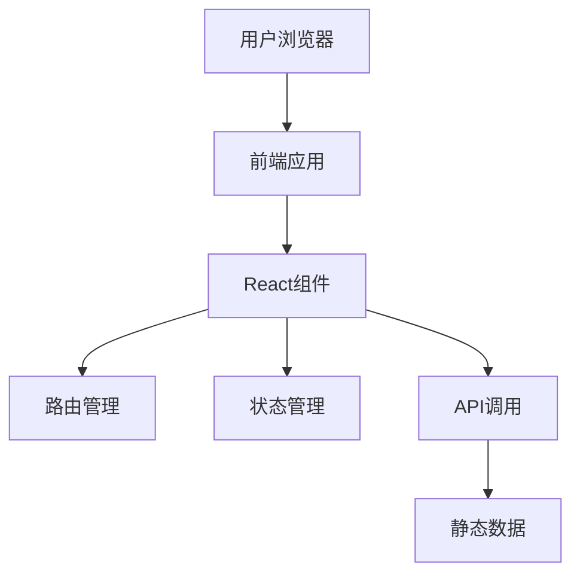

## 1. Architecture Design

## 2. Technology Description
- Frontend: React@18 + tailwindcss@3 + vite
- Initialization Tool: vite-init
- Backend: None (静态网站)
- Database: None (使用静态数据)

## 3. Route Definitions
| Route | Purpose |
|-------|---------|
| / | 首页，展示个人简介、技能和项目 |
| /about | 关于页面，展示详细个人背景 |
| /projects | 项目页面，展示项目详情 |

## 4. API Definitions
- 不适用，本项目为静态网站，使用本地静态数据

## 5. Server Architecture Diagram
- 不适用，本项目为纯前端静态网站

## 6. Data Model
- 不适用，本项目使用静态数据，无需数据库

### 6.1 Data Model Definition
- 不适用

### 6.2 Data Definition Language
- 不适用